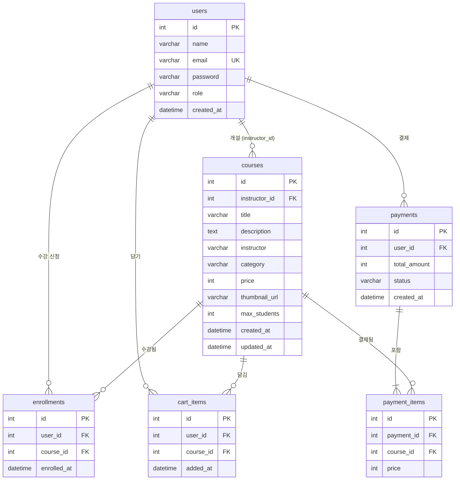

아래에 정의된 고정 스펙을 그대로 사용해 PRD를 작성하라.
추가 조사나 추론 없이 아래 내용만을 출력에 사용한다.
형식은 Markdown, 언어는 한국어로 작성한다.

---

# PRD 고정 스펙

## 프로젝트 기본 정보
- 이름: OU (Online University)
- 유형: 풀스택 온라인 강의 플랫폼
- 설명: 강사가 강의를 개설하고, 학생이 강의를 탐색·결제·수강 신청할 수 있는 이러닝 마켓플레이스
- 대상 사용자: 학생, 강사, 관리자

## 기술 스택
### 프론트엔드
- React 18.3.1 + TypeScript 5.6.2
- Vite 6.0.1 (빌드 도구)
- React Router DOM 6.28.0 (라우팅)
- 상태 관리: React Context API
- 스타일: Inline CSS (CSS 프레임워크 미사용)
- HTTP: Fetch API
- 인증 토큰 저장: localStorage

### 백엔드
- NestJS 11.0.1 + TypeScript 5.7.3
- MySQL + TypeORM 0.3.28
- 인증: JWT (Passport.js, bcrypt)
- 검증: class-validator, class-transformer
- API 문서: Swagger/OpenAPI

## 사용자 역할 및 권한

### student (학생)
- 강의 목록 조회 및 검색·필터
- 강의 상세 조회
- 장바구니 담기/제거/전체 비우기
- 결제(체크아웃) 후 수강 신청
- 본인 수강 목록 조회 및 수강 취소

### instructor (강사)
- 강의 생성
- 본인이 개설한 강의만 수정·삭제
- 본인 강의의 수강생 목록 조회

### admin (관리자)
- 모든 강의 생성·수정·삭제
- 직접 수강 등록 (결제 없이 POST /enrollments)
- 모든 강의의 수강생 목록 조회
- 장바구니·결제 기능 사용 가능 (학생과 동일)

### 비로그인 사용자
- 강의 목록·상세 조회만 가능
- 장바구니·수강 신청 불가

## 프론트엔드 페이지 목록

| 경로 | 페이지명 | 설명 | 접근 권한 |
|------|----------|------|-----------|
| `/` | 강의 목록 | 전체 강의 목록, 카테고리 필터, 제목·강사 검색, 페이지네이션(6개/페이지) | 공개 |
| `/login` | 로그인 | 이메일·비밀번호 인증 | 공개 |
| `/users/register` | 회원가입 | 이름·이메일·비밀번호·역할 선택으로 계정 생성 | 공개 |
| `/courses/new` | 강의 생성 | 강의 정보 입력 폼 | 강사·관리자 |
| `/courses/:id` | 강의 상세 | 강의 전체 정보, 수용 인원 바, 수강 신청/장바구니/수정/삭제 버튼 | 공개 (액션은 로그인 필요) |
| `/courses/:id/edit` | 강의 수정 | 기존 강의 정보 수정 폼 | 강의 개설자·관리자 |
| `/courses/:id/students` | 수강생 목록 | 해당 강의 수강생 테이블 (이름, 이메일, 신청일) | 강의 개설자·관리자 |
| `/enrollments` | 수강 목록 | 본인이 수강 중인 강의 목록, 취소 기능 | 학생·관리자 |
| `/cart` | 장바구니 | 담은 강의 목록, 총 금액, 체크아웃 이동 | 학생·관리자 |
| `/checkout` | 결제 | 모의 카드 결제 폼, 주문 요약, 결제 후 수강 등록 | 학생·관리자 |

## API 엔드포인트

### 인증 (Auth)
| 메서드 | 경로 | 인증 | 설명 |
|--------|------|------|------|
| POST | `/api/auth/register` | 없음 | 회원가입. 응답: `{ access_token, user }`. 이메일 중복 시 409 |
| POST | `/api/auth/login` | 없음 | 로그인. 응답: `{ access_token, user }`. 인증 실패 시 401 |

### 강의 (Courses)
| 메서드 | 경로 | 인증 | 설명 |
|--------|------|------|------|
| GET | `/api/courses` | 없음 | 강의 목록 (query: category?, page?, limit?). 응답: `{ data, total, page, limit }` |
| GET | `/api/courses/:id` | 없음 | 강의 단건 조회. 없으면 404 |
| POST | `/api/courses` | JWT (강사·관리자) | 강의 생성. 201 반환 |
| PATCH | `/api/courses/:id` | JWT (개설자·관리자) | 강의 수정. 타인 강의 시도 시 403 |
| DELETE | `/api/courses/:id` | JWT (개설자·관리자) | 강의 삭제. 타인 강의 시도 시 403. 204 반환 |
| GET | `/api/courses/:id/enrollments` | JWT (개설자·관리자) | 수강생 목록. 타인 강의 시도 시 403 |

### 사용자 (Users)
| 메서드 | 경로 | 인증 | 설명 |
|--------|------|------|------|
| GET | `/api/users/:id` | 없음 | 사용자 조회 |
| GET | `/api/users/:id/enrollments` | JWT | 사용자 수강 목록. 본인 또는 관리자만 가능, 타인 시도 시 403 |

### 수강 신청 (Enrollments)
| 메서드 | 경로 | 인증 | 설명 |
|--------|------|------|------|
| POST | `/api/enrollments` | JWT (관리자) | 직접 수강 등록. 중복 시 409 |
| DELETE | `/api/enrollments/:id` | JWT | 수강 취소. 본인 또는 관리자만 가능. 204 반환 |

### 장바구니 (Cart)
| 메서드 | 경로 | 인증 | 설명 |
|--------|------|------|------|
| GET | `/api/cart` | JWT (학생·관리자) | 장바구니 조회 |
| POST | `/api/cart` | JWT (학생·관리자) | 강의 추가. 중복 시 409 |
| DELETE | `/api/cart/:id` | JWT (학생·관리자) | 항목 제거. 본인 항목만 가능. 204 반환 |
| DELETE | `/api/cart` | JWT (학생·관리자) | 장바구니 전체 비우기. 204 반환 |

### 결제 (Payments)
| 메서드 | 경로 | 인증 | 설명 |
|--------|------|------|------|
| POST | `/api/payments` | JWT (학생·관리자) | 결제 및 수강 등록. body: `{ course_ids: number[] }`. 이미 수강 중이면 409. 성공 시 장바구니 삭제 후 201 반환 |
| GET | `/api/payments` | JWT (학생·관리자) | 결제 내역 조회. 최신순 정렬 |

## 데이터 모델

### users
| 컬럼 | 타입 | 제약 |
|------|------|------|
| id | int | PK, auto increment |
| name | varchar | NOT NULL |
| email | varchar | NOT NULL, UNIQUE |
| password | varchar | NOT NULL (bcrypt 해시) |
| role | varchar | NOT NULL, default 'student' |
| created_at | datetime | auto |

### courses
| 컬럼 | 타입 | 제약 |
|------|------|------|
| id | int | PK, auto increment |
| instructor_id | int | FK → users.id, nullable |
| title | varchar | NOT NULL |
| description | text | NOT NULL |
| instructor | varchar | NOT NULL (비정규화 이름) |
| category | varchar | NOT NULL |
| price | int | NOT NULL |
| thumbnail_url | varchar | nullable |
| max_students | int | NOT NULL |
| created_at | datetime | auto |
| updated_at | datetime | auto |

### enrollments
| 컬럼 | 타입 | 제약 |
|------|------|------|
| id | int | PK |
| user_id | int | FK → users.id |
| course_id | int | FK → courses.id |
| enrolled_at | datetime | auto |

### cart_items
| 컬럼 | 타입 | 제약 |
|------|------|------|
| id | int | PK |
| user_id | int | FK → users.id, CASCADE |
| course_id | int | FK → courses.id, CASCADE |
| added_at | datetime | auto |

### payments
| 컬럼 | 타입 | 제약 |
|------|------|------|
| id | int | PK |
| user_id | int | FK → users.id |
| total_amount | int | NOT NULL |
| status | varchar | default 'completed' |
| created_at | datetime | auto |

### payment_items
| 컬럼 | 타입 | 제약 |
|------|------|------|
| id | int | PK |
| payment_id | int | FK → payments.id, CASCADE |
| course_id | int | FK → courses.id, CASCADE |
| price | int | NOT NULL (결제 시점 가격) |

## ERD (Mermaid)

## 비즈니스 규칙

### 강의 관리
- 강사는 본인 강의만 수정·삭제 가능 (관리자는 모든 강의 가능)
- 강의 삭제 시 연관 수강 신청·장바구니 항목 CASCADE 삭제
- 강의별 최대 수강 인원 초과 시 수강 신청 불가 (버튼 비활성화)
- 카테고리: 프론트엔드, 백엔드, 데이터사이언스, DevOps, UI/UX, 모바일, 기타

### 수강 신청 및 결제
- 학생은 반드시 장바구니 → 결제 경로로 수강 신청
- 관리자는 POST /enrollments로 직접 수강 등록 가능 (결제 불필요)
- 동일 강의 중복 수강 신청 불가 (409)
- 결제 성공 시 장바구니 항목 자동 삭제 후 수강 등록
- 결제 금액 = 결제 시점 강의 가격의 합산 (payment_items에 기록)
- 결제 처리는 모의(simulated) 방식, 실제 PG 연동 없음

### 인증
- JWT 유효기간: 7일
- 비밀번호: bcrypt 해시 (salt 10)
- JWT payload: `{ sub: userId, email, role }`
- 토큰·사용자 정보 localStorage 저장 (`access_token`, `currentUser`)
- 토큰 갱신 없음

### 유효성 검증
- 이메일: 유효한 이메일 형식 필수
- 비밀번호: 최소 6자
- 강의 가격: 0 이상 정수
- max_students: 1 이상

---

# 출력 형식

위 고정 스펙을 바탕으로 아래 구조로 PRD를 작성하라.
각 섹션은 반드시 포함하고, 내용은 위 스펙에서만 가져온다.

1. **프로젝트 개요** — 프로젝트명, 유형, 목적, 대상 사용자
2. **기술 스택** — 프론트엔드 / 백엔드 테이블로 정리
3. **사용자 역할 및 권한** — 역할별 권한을 테이블로 정리
4. **기능 요구사항** — 페이지별 기능을 테이블로 정리
5. **API 명세** — 모듈별 엔드포인트 테이블
6. **데이터 모델** — 엔티티별 컬럼 테이블
7. **ERD** — 위 Mermaid 코드 블록 그대로 출력
8. **비즈니스 규칙** — 카테고리별 규칙 목록
